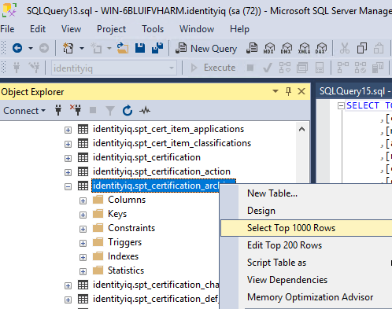
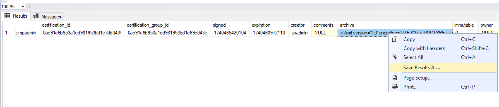
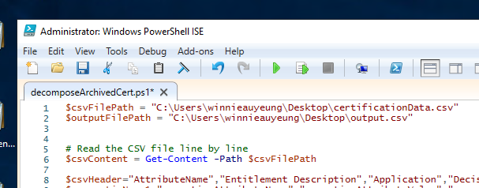

# Sailpoint-IIQ_Decompose-Certification-Archives
The Sailpoint IIQ  provides functionality to archive the certification campaign. But cannot decompose the archived certification. The PowerShell script is for generating the csv report based on the archived data export from the SailPoint DB.

Scenario:
* MSSQL
* SailPoint IdentityIQ

Step One - Export the archived certification form DB
images
1. Go the Table identityiq.spt._certification_achive.
2. Right click and select the option "Select Top 1000 Rows". And then Execute the sql script.
     
4. In the result console, find and select the column named "archive"
5. Right click and sava the archived data as csv file. 
    

Step Two - Change the file directory in the PowerShell script
1. Input CSV file directory
2. Output CSV file directory
    
